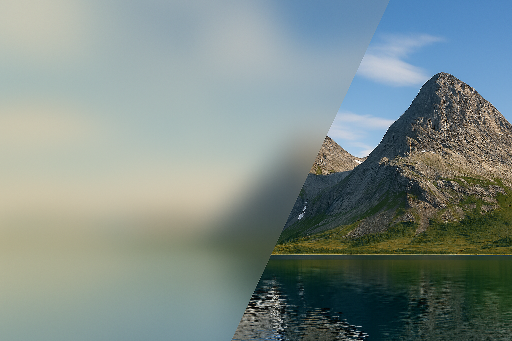

# 🖼️ astro-lqip

[](https://www.npmjs.com/package/astro-lqip)
[](https://github.com/felixicaza/astro-lqip/blob/main/LICENSE)

A integration built over the native Astro component that generates low-quality image placeholders (LQIP) for your images.

## ⬇️ Installation

NPM:

```bash
npm install astro-lqip
```

PNPM:

```bash
pnpm add astro-lqip
```

Yarn:

```bash
yarn add astro-lqip
```

## 🚀 Usage

In your current Astro project, just replace the native Astro `<Picture>` component with the one provided by this integration.

```astro
- import { Picture } from 'astro:assets';
+ import { Picture } from 'astro-lqip/components';
```

## 📝 ToDo

- [ ] Add support for Image component.
- [ ] Add support for more lqip techniques.
- [ ] Optimize current CSS usage.
- [ ] Improve demo page.

## 💡 Knowledge

Since this integration is built on top of Astro's native `<Picture>` component, you can refer to the [Astro documentation](https://docs.astro.build/en/guides/images/#picture-) for more information on how to use it.

## 🤝 Contributing
If you wish to contribute to this project, you can do so by reading the [contribution guide](https://github.com/felixicaza/astro-lqip/blob/main/CONTRIBUTING.md).

## 📄 License
This project is licensed under the MIT License. See the [license file](https://github.com/felixicaza/astro-lqip/blob/main/LICENSE) for more details.
